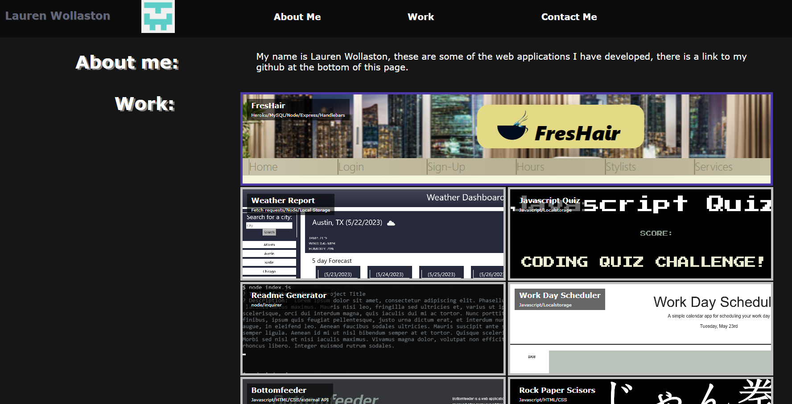

# Professional Portfolio       

## Description

A portfolio that showcases my work and contact information, my most prominant work is given a larger section of the page, and the website is responsive to mobile screens.

## Acceptence Criteria

WHEN I load their portfolio
THEN I am presented with the developer's name, a recent photo or avatar, and links to sections about them, their work, and how to contact them
✔️
WHEN I click one of the links in the navigation
THEN the UI scrolls to the corresponding section
✔️
WHEN I click on the link to the section about their work
THEN the UI scrolls to a section with titled images of the developer's applications
✔️
WHEN I am presented with the developer's first application
THEN that application's image should be larger in size than the others
✔️
WHEN I click on the images of the applications
THEN I am taken to that deployed application
✔️
WHEN I resize the page or view the site on various screens and devices
THEN I am presented with a responsive layout that adapts to my viewport
✔️

## Installation

Everything runs in browser from github pages. Everything uses plain css and HTML

## Contribution Guidelines

This is a finished project and no further contribution is needed.

## Testing Instructions

## License

CC0

## Questions

[Github](https://github.com/LaurenWollaston)
[E-Mail](mailto:laurenofw@gmail.com)
[Deployed App](https://laurenwollaston.github.io/Module-02/)

Demo

